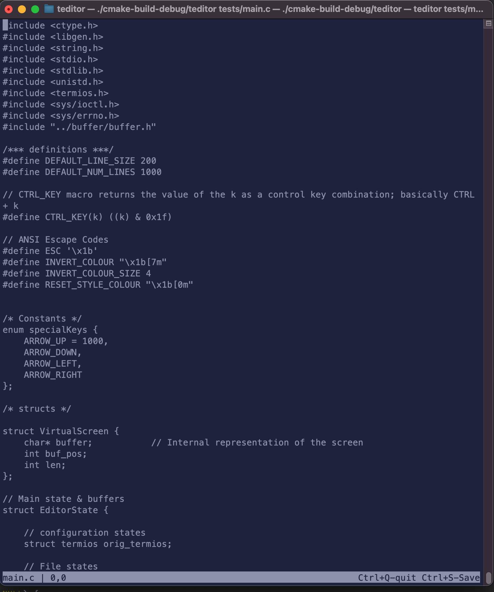

# TED Editor

An attempt to build a text editor from scratch in c.

[Kilo](https://github.com/antirez/kilo) was used as a reference for handling escape codes, things of that nature.

### TODO:

- [x] Build buffer
- [x] Render buffer
- [x] Load file
- []  Safe exit/backups
- [-] Save buffer to file
- [-] Show/update changed status
- [-] Inserts/editing
- [-] Additional navigation 
- [] Refactoring

### What it looks like so far:

